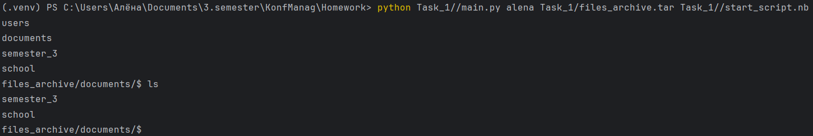
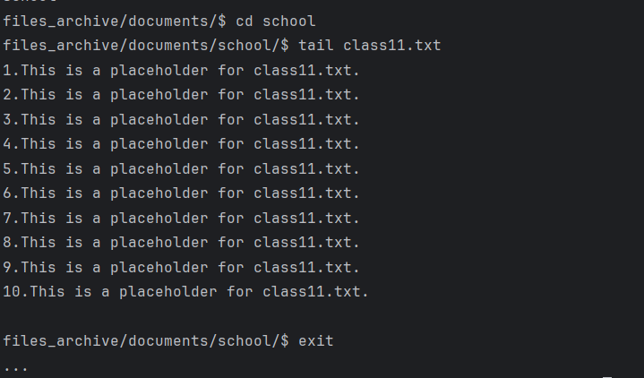
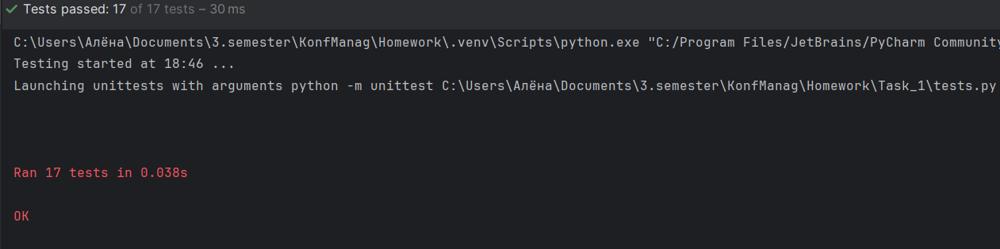

# Домашние задания по конфигурационному управлению
## Описание 
В данном репозитории расположены выполненные домашние задания по дисциплине "Конфигурационное управление" 
## Задание 1
### Описание
Эмулятор для языка оболочки ОС, похожий на сеанс на сеанс shell в UNIX-подобной ОС. Он должен запускаться из реальной командной строки, а файл с
виртуальной файловой системой не нужно распаковывать у пользователя. 
Эмулятор принимает образ виртуальной файловой системы в виде файла формата
tar. Эмулятор должен работать в режиме CLI.
Ключами командной строки задаются:
- Имя пользователя для показа в приглашении к вводу.
- Путь к архиву виртуальной файловой системы.
- Путь к стартовому скрипту.

### Структура программы
- main.py — содержит класс Shell, реализующий все необходимые функции, а также функции для выполнения стартового скрипта и т.п.
### Функции
- Эмуляция команд: ls, cd, exit, chown, tail, du;
- Исполнение стартового скрипта при запуске программы.
### Демонстрация работоспособности
Ниже показаны примеры использования данной программы.

### Результаты тестирования
Для каждой из требуемых функций были написаны тесты. Результат их прохождения показан ниже.
