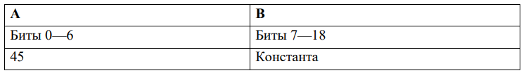
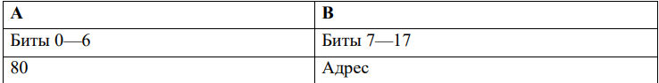
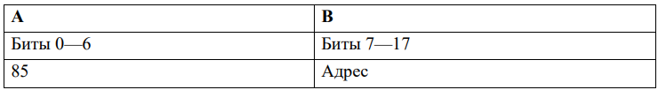
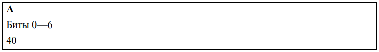
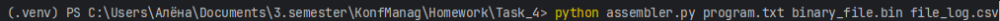
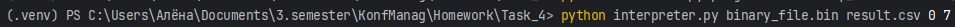
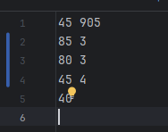
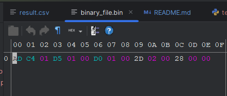
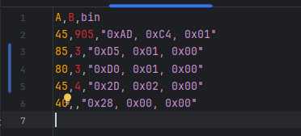
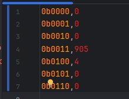

# Домашние задания по конфигурационному управлению
## Описание 
В данном репозитории расположены выполненные домашние задания по дисциплине "Конфигурационное управление" 
## Задание 1
### Описание
Эмулятор для языка оболочки ОС, похожий на сеанс на сеанс shell в UNIX-подобной ОС. Он должен запускаться из реальной командной строки, а файл с
виртуальной файловой системой не нужно распаковывать у пользователя. 
Эмулятор принимает образ виртуальной файловой системы в виде файла формата
tar. Эмулятор должен работать в режиме CLI.
Ключами командной строки задаются:
- Имя пользователя для показа в приглашении к вводу.
- Путь к архиву виртуальной файловой системы.
- Путь к стартовому скрипту.

### Структура программы
- main.py — содержит класс Shell, реализующий все необходимые функции, а также функции для выполнения стартового скрипта и т.п.
### Функции
- _ls() - эмуляция команды ls,
- _cd() - эмуляция команды cd
- _chown() - эмуляция команды chown
- _tail() - эмуляция команды tail
- _du() - эмуляция команды du
- execute() - эмуляция работы командной строки
- run_start_script - Исполнение стартового скрипта при запуске программы
- run_program() - запуск программы
### Демонстрация работоспособности
Ниже показаны примеры использования данной программы.

  

  

### Результаты тестирования
Для каждой из требуемых функций были написаны тесты. Результат их прохождения показан ниже.

  

## Задание 2
### Описание
Разработать инструмент командной строки для визуализации графа
зависимостей, включая транзитивные зависимости. Сторонние программы или
библиотеки для получения зависимостей использовать нельзя.
Зависимости определяются для файла-пакета платформы .NET (nupkg). Для
описания графа зависимостей используется представление Mermaid.
Визуализатор должен выводить результат на экран в виде кода.
Ключами командной строки задаются:
- Путь к программе для визуализации графов.
- Путь к анализируемому пакету.
- Путь к файлу-результату в виде кода.
- URL-адрес репозитория.

### Структура программы
- main.py — содержит функции для выполнения задания
### Функции
- download_package() - устанавливает пакет из указанного репозитория
- find_nuspec() - находит файл, содержащий манифест 
- get_dependencies() - извлекает и сохраняет зависимости из файла-манифеста
- build_graph() - строит граф по правилам согласно заданию
- save_result() - сохраняет результат в виде кода в указанном файле
- visualize_graph() - визуализирует граф
- main() - запуск программы
### Демонстрация работоспособности
Ниже показаны примеры использования данной программы.
Отображение графа зависимостей в виде кода:

  

Визуализация графа:

  

### Результаты тестирования
Для каждой из требуемых функций были написаны тесты. Результат их прохождения показан ниже.

  

## Задание 3
### Описание
Разработать инструмент командной строки для учебного конфигурационного
языка, синтаксис которого приведен далее. Этот инструмент преобразует текст из
входного формата в выходной. Синтаксические ошибки выявляются с выдачей
сообщений.
Входной текст на учебном конфигурационном языке принимается из
стандартного ввода. Выходной текст на языке json попадает в стандартный
вывод.
- Однострочные комментарии:
\ Это однострочный комментарий
- Массивы:
'( значение значение значение ... )
- Словари:
{
 имя = значение;
 имя = значение;
 имя = значение;
 ...
}
- Имена:
[A-Z]+
- Значения:
  1. Числа.
  2. Строки.
  3. Массивы.
  4. Словари.
- Строки:
"Это строка"
- Объявление константы на этапе трансляции:
let имя = значение;
- Вычисление константы на этапе трансляции:
.[имя].
Результатом вычисления константного выражения является значение.
Все конструкции учебного конфигурационного языка (с учетом их
возможной вложенности) должны быть покрыты тестами. Необходимо показать 2
примера описания конфигураций из разных предметных областей.

### Структура программы
- main.py — содержит функции для выполнения задания
### Функции
- parse_text() - разбирает входящий текст
- parse_value() - разбирает входящее значение на соответствие правилам 
- calculating_constant() - вычисляет значение константы
- parse_brackets() - считает количество словарей, в которых находимся на этапе чтения.
- parse_brackets_array() - считает количество массивов, в которых находимся на этапе чтения. 
- main() - запуск программы, чтение и вывод с помощью стандартного потока
### Демонстрация работоспособности
Ниже показаны примеры описания конфигураций из разных предметных областей.

Тест 1:

  

Тест 2:

  

### Результаты тестирования
Для каждой из требуемых функций были написаны тесты. Результат их прохождения показан ниже.

  

## Задание 4
### Описание
Разработать ассемблер и интерпретатор для учебной виртуальной машины
(УВМ). Система команд УВМ представлена далее.

Для ассемблера необходимо разработать читаемое представление команд
УВМ. Ассемблер принимает на вход файл с текстом исходной программы, путь к
которой задается из командной строки. Результатом работы ассемблера является
бинарный файл в виде последовательности байт, путь к которому задается из
командной строки. Дополнительный ключ командной строки задает путь к файлулогу, в котором хранятся ассемблированные инструкции в духе списков
“ключ=значение”, как в приведенных далее тестах.

Интерпретатор принимает на вход бинарный файл, выполняет команды УВМ
и сохраняет в файле-результате значения из диапазона памяти УВМ. Диапазон
также указывается из командной строки.
Форматом для файла-лога и файла-результата является csv. 
- Загрузка константы

  

Размер команды: 3 байт. Операнд: поле B. Результат: новый элемент на стеке.
Тест (A=45, B=905):
0xAD, 0xC4, 0x01

- Чтение из памяти

  

Размер команды: 3 байт. Операнд: ячейка памяти по адресу, которым
является поле B. Результат: новый элемент на стеке.
Тест (A=80, B=492):
0x50, 0xF6, 0x00

- Запись в память

  

Размер команды: 3 байт. Операнд: элемент, снятый с вершины стека.
Результат: ячейка памяти по адресу, которым является поле B.
Тест (A=85, B=93):
0xD5, 0x2E, 0x00

- Унарная операция: bswap()

  

Размер команды: 3 байт. Операнд: элемент, снятый с вершины стека.
Результат: ячейка памяти по адресу, которым является элемент, снятый с вершины
стека.
Тест (A=40):
0x28, 0x00, 0x00

### Структура программы
- assembler.py — содержит класс Assembler, реализующий задачи, прописанные в условии
- interpreter.py — содержит класс Interpreter, реализующий задачи, прописанные в условии
- binary_file.bin - бинарный файл, результатом работы ассемблера 
- program.txt - файл с текстом исходной программы
- file_log.csv - файл-лог, в котором хранятся ассемблированные инструкции в духе списков
- result.csv - файл-результат
### Функции
Методы класса Assembler:
- log() - создание лог-записей
- write_to_binary() - запись в бинарный файл
- write_log() - запись в файл-лог
- int_to_hex() - реализация кодировки 
- run() - запуск ассемблера 
Методы класса Interpreter:
- save_results() - сохранение результатов в файл
- run() - запуск интерпретатора
### Демонстрация работоспособности
Запуск ассемблера:

  

Запуск интерпретатора:

  

Программа выгляди следующим образом:

  

Запись в бинарном файле показана ниже.

  

Запись в лог-файле продемонстрирована ниже.

  

Результат выглядит следующим образом:

  

### Результаты тестирования
Для каждой из требуемых функций были написаны тесты. Результат их прохождения показан ниже.
Тестирование ассемблера:

  

Тестирование интерпретатора:

  

Была выполнена тестовая программа. Результат выполнения продемонстрирован ниже.

  

